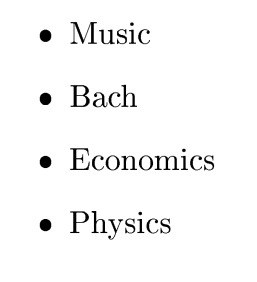

# R interface to Google Gemini API

Functions to use Gemini from R. In development. Currently supports:

- Basic prompts
- JSON output also with structured response
- Upload of images, pdf and other documents

See examples below.

# Installation

Best install from r-universe:

```r
install.packages('rgemini', repos = c('https://skranz.r-universe.dev', 'https://cloud.r-project.org'))
```

Otherwise try to install directly from Github:

```r
if (!requireNamespace("remotes", quietly = TRUE)) { install.packages("remotes") }
remotes::install_github("skranz/rgemini") 
```

# Examples


## 1. Set API key and Basic prompt

```{r echo=FALSE}
library(rgemini)
set_gemini_api_key(file = "~/repbox/gemini/gemini_api_key.txt")
```

Load library and specify API key.
```{r eval=FALSE}
library(rgemini)
set_gemini_api_key("<YOUR GEMINI API KEY>")
```

A simple prompt.
```{r}
run_gemini("Tell a joke.")
```

Return more details of Gemini API response (possible error codes etc)

```{r}
res = run_gemini("Tell a joke.",detailed_results = TRUE)
str(res)
```


## 2. JSON mode without schema

```{r}
run_gemini("Tell 2 jokes. Return JSON with fields 'topic' and 'joke'.",json_mode = TRUE)
```

# 3. JSON mode with a response schema

We use `arr_resp` or `obj_resp` to build an example response, from which `response_schema` builds a proper JSON schema that can be passed to `run_gemini`

NOTE: In future, it will be better to use use my package https://github.com/skranz/DataSchema to build response schemas. Examples will be adapted. 

```{r}
prompt = "List 3 asian countries, their capital, the most famous building and the countries' inhabitants in million."

# Creates a schema from an example
schema = response_schema(arr_resp(capital = "Paris", country="France", famous_building="Eiffel Tower", population = 60.1))

run_gemini(prompt = prompt,response_schema = schema)

```

Here is a more comples nested schema. Will return nested tibbles.

```{r}
prompt = "Show info for one african country, its capital with name and population in mio, the most famous building and inhabitants in million. Add three facts about the country."

# obj_resp expects to return a single object
# arr_resp expected a list of objects
# Both can be nested
schema = response_schema(obj_resp(
  capital = obj_resp(capital="Paris", cap_pop=5),
  country="France", famous_building="Eiffel Tower",
  population = 60.2,
  facts = arr_resp(factno=1L, name="fact1", descr="fact_description")
))

# For this schema run_gemini currently
# returns a list (obj_resp) or data frame (arr_resp) with nested data frames
res = run_gemini(prompt = prompt,response_schema = schema)
str(res)
```


## 4. Use an image

That is the image we upload:




```{r}
img_file = paste0("~/repbox/gemini/word_img.png")
media <- gemini_media_upload(img_file)
run_gemini("Please write down all words you can detect in the image.", media=media)
```


## 5. Use a PDF and an Image

```{r}
files = c("~/repbox/gemini/word_img.png", "~/repbox/gemini/colors_pdf.pdf")
media <- gemini_media_upload(files)
run_gemini("Please write down all words you can detect in the uploaded pdf and image.", media=media)

```
