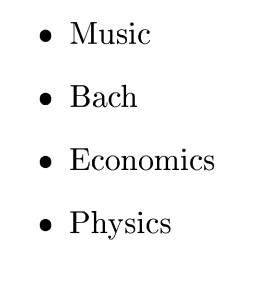

# R interface to Google Gemini API

Functions to use Gemini from R. In development. Currently supports:

- Basic prompts
- JSON output also with structured response
- Upload of images, pdf and other documents

See examples below.

# Installation

Best install from r-universe:

```r
install.packages('rgemini', repos = c('https://skranz.r-universe.dev', 'https://cloud.r-project.org'))
```

Otherwise try to install directly from Github:

```r
if (!requireNamespace("remotes", quietly = TRUE)) { install.packages("remotes") }
remotes::install_github("skranz/rgemini") 
```

# Examples


## 1. Set API key and Basic prompt

Load library and specify API key.

```r
library(rgemini)
set_gemini_api_key("<YOUR GEMINI API KEY>")
```

A simple prompt.

```r
run_gemini("Tell a joke.")
```

```
## [1] "Why don't scientists trust atoms?\n\nBecause they make up everything!\n"
```

Return more details of Gemini API response (possible error codes etc)


```r
res = run_gemini("Tell a joke.",detailed_results = TRUE)
str(res)
```

```
## List of 9
##  $ has_error  : logi FALSE
##  $ status_code: int 200
##  $ httr_resp  :List of 10
##   ..$ url        : chr "https://generativelanguage.googleapis.com/v1beta/models/gemini-2.0-flash:generateContent?key=AIzaSyCzge4rKQDd_7"| __truncated__
##   ..$ status_code: int 200
##   ..$ headers    :List of 13
##   .. ..$ content-type          : chr "application/json; charset=UTF-8"
##   .. ..$ vary                  : chr "Origin"
##   .. ..$ vary                  : chr "X-Origin"
##   .. ..$ vary                  : chr "Referer"
##   .. ..$ content-encoding      : chr "gzip"
##   .. ..$ date                  : chr "Thu, 27 Feb 2025 19:26:30 GMT"
##   .. ..$ server                : chr "scaffolding on HTTPServer2"
##   .. ..$ content-length        : chr "335"
##   .. ..$ x-xss-protection      : chr "0"
##   .. ..$ x-frame-options       : chr "SAMEORIGIN"
##   .. ..$ x-content-type-options: chr "nosniff"
##   .. ..$ server-timing         : chr "gfet4t7; dur=451"
##   .. ..$ alt-svc               : chr "h3=\":443\"; ma=2592000,h3-29=\":443\"; ma=2592000"
##   .. ..- attr(*, "class")= chr [1:2] "insensitive" "list"
##   ..$ all_headers:List of 1
##   .. ..$ :List of 3
##   .. .. ..$ status : int 200
##   .. .. ..$ version: chr "HTTP/2"
##   .. .. ..$ headers:List of 13
##   .. .. .. ..$ content-type          : chr "application/json; charset=UTF-8"
##   .. .. .. ..$ vary                  : chr "Origin"
##   .. .. .. ..$ vary                  : chr "X-Origin"
##   .. .. .. ..$ vary                  : chr "Referer"
##   .. .. .. ..$ content-encoding      : chr "gzip"
##   .. .. .. ..$ date                  : chr "Thu, 27 Feb 2025 19:26:30 GMT"
##   .. .. .. ..$ server                : chr "scaffolding on HTTPServer2"
##   .. .. .. ..$ content-length        : chr "335"
##   .. .. .. ..$ x-xss-protection      : chr "0"
##   .. .. .. ..$ x-frame-options       : chr "SAMEORIGIN"
##   .. .. .. ..$ x-content-type-options: chr "nosniff"
##   .. .. .. ..$ server-timing         : chr "gfet4t7; dur=451"
##   .. .. .. ..$ alt-svc               : chr "h3=\":443\"; ma=2592000,h3-29=\":443\"; ma=2592000"
##   .. .. .. ..- attr(*, "class")= chr [1:2] "insensitive" "list"
##   ..$ cookies    :'data.frame':	0 obs. of  7 variables:
##   .. ..$ domain    : logi(0) 
##   .. ..$ flag      : logi(0) 
##   .. ..$ path      : logi(0) 
##   .. ..$ secure    : logi(0) 
##   .. ..$ expiration: 'POSIXct' num(0) 
##   .. ..$ name      : logi(0) 
##   .. ..$ value     : logi(0) 
##   ..$ content    : raw [1:674] 7b 0a 20 20 ...
##   ..$ date       : POSIXct[1:1], format: "2025-02-27 19:26:30"
##   ..$ times      : Named num [1:6] 0 0.00003 0.000031 0.000127 0.000167 ...
##   .. ..- attr(*, "names")= chr [1:6] "redirect" "namelookup" "connect" "pretransfer" ...
##   ..$ request    :List of 7
##   .. ..$ method    : chr "POST"
##   .. ..$ url       : chr "https://generativelanguage.googleapis.com/v1beta/models/gemini-2.0-flash:generateContent?key=AIzaSyCzge4rKQDd_7"| __truncated__
##   .. ..$ headers   : Named chr [1:2] "application/json, text/xml, application/xml, */*" "application/json"
##   .. .. ..- attr(*, "names")= chr [1:2] "Accept" "Content-Type"
##   .. ..$ fields    : NULL
##   .. ..$ options   :List of 4
##   .. .. ..$ useragent    : chr "libcurl/7.68.0 r-curl/4.3.2 httr/1.4.2"
##   .. .. ..$ post         : logi TRUE
##   .. .. ..$ postfieldsize: int 117
##   .. .. ..$ postfields   : raw [1:117] 7b 22 63 6f ...
##   .. ..$ auth_token: NULL
##   .. ..$ output    : list()
##   .. .. ..- attr(*, "class")= chr [1:2] "write_memory" "write_function"
##   .. ..- attr(*, "class")= chr "request"
##   ..$ handle     :Class 'curl_handle' <externalptr> 
##   ..- attr(*, "class")= chr "response"
##  $ resp_json  : chr "{\n  \"candidates\": [\n    {\n      \"content\": {\n        \"parts\": [\n          {\n            \"text\": \"| __truncated__
##  $ resp       :List of 6
##   ..$ candidates   :'data.frame':	1 obs. of  3 variables:
##   .. ..$ content     :'data.frame':	1 obs. of  2 variables:
##   .. .. ..$ parts:List of 1
##   .. .. .. ..$ :'data.frame':	1 obs. of  1 variable:
##   .. .. .. .. ..$ text: chr "Why don't scientists trust atoms?\n\nBecause they make up everything!\n"
##   .. .. ..$ role : chr "model"
##   .. ..$ finishReason: chr "STOP"
##   .. ..$ avgLogprobs : num -0.00303
##   ..$ usageMetadata:List of 5
##   .. ..$ promptTokenCount       : int 4
##   .. ..$ candidatesTokenCount   : int 16
##   .. ..$ totalTokenCount        : int 20
##   .. ..$ promptTokensDetails    :'data.frame':	1 obs. of  2 variables:
##   .. .. ..$ modality  : chr "TEXT"
##   .. .. ..$ tokenCount: int 4
##   .. ..$ candidatesTokensDetails:'data.frame':	1 obs. of  2 variables:
##   .. .. ..$ modality  : chr "TEXT"
##   .. .. ..$ tokenCount: int 16
##   ..$ modelVersion : chr "gemini-2.0-flash"
##   ..$ model        : chr "gemini-2.0-flash"
##   ..$ temperature  : num 0.1
##   ..$ json_mode    : logi FALSE
##  $ err_msg    : chr ""
##  $ err_step   : chr ""
##  $ res_df     :'data.frame':	1 obs. of  8 variables:
##   ..$ model             : chr "gemini-2.0-flash"
##   ..$ json_mode         : logi FALSE
##   ..$ temperature       : num 0.1
##   ..$ input_token_count : int 4
##   ..$ output_token_count: int 16
##   ..$ cached_token_count: num 0
##   ..$ finishReason      : chr "STOP"
##   ..$ content           : chr "Why don't scientists trust atoms?\n\nBecause they make up everything!\n"
##  $ content    : chr "Why don't scientists trust atoms?\n\nBecause they make up everything!\n"
```


## 2. JSON mode without schema


```r
run_gemini("Tell 2 jokes. Return JSON with fields 'topic' and 'joke'.",json_mode = TRUE)
```

```
##         topic                                                              joke
## 1 Programming Why do programmers prefer dark mode? Because light attracts bugs!
## 2        Math            Why was six afraid of seven? Because seven eight nine!
```

# 3. JSON mode with a response schema

We use `arr_resp` or `obj_resp` to build an example response, from which `response_schema` builds a proper JSON schema that can be passed to `run_gemini`

NOTE: In future, it will be better to use use my package https://github.com/skranz/DataSchema to build response schemas. Examples will be adapted. 


```r
prompt = "List 3 asian countries, their capital, the most famous building and the countries' inhabitants in million."

# Creates a schema from an example
schema = response_schema(arr_resp(capital = "Paris", country="France", famous_building="Eiffel Tower", population = 60.1))

run_gemini(prompt = prompt,response_schema = schema)
```

```
##      [,1]      [,2]        [,3]                  [,4]                   
## [1,] "Country" "Capital"   "Famous Building"     "Population (millions)"
## [2,] "Japan"   "Tokyo"     "Tokyo Skytree"       "125.7"                
## [3,] "China"   "Beijing"   "Great Wall of China" "1453"                 
## [4,] "India"   "New Delhi" "Taj Mahal"           "1406.6"
```

Here is a more comples nested schema. Will return nested tibbles.


```r
prompt = "Show info for one african country, its capital with name and population in mio, the most famous building and inhabitants in million. Add three facts about the country."

# obj_resp expects to return a single object
# arr_resp expected a list of objects
# Both can be nested
schema = response_schema(obj_resp(
  capital = obj_resp(capital="Paris", cap_pop=5),
  country="France", famous_building="Eiffel Tower",
  population = 60.2,
  facts = arr_resp(factno=1L, name="fact1", descr="fact_description")
))

# For this schema run_gemini currently
# returns a list (obj_resp) or data frame (arr_resp) with nested data frames
res = run_gemini(prompt = prompt,response_schema = schema)
str(res)
```

```
## List of 5
##  $ capital        :List of 2
##   ..$ cap_pop: int 29
##   ..$ capital: chr "Nairobi"
##  $ country        : chr "Kenya"
##  $ facts          : int [1, 1:3] 1 2 3
##  $ famous_building: chr "Kenyatta International Conference Centre"
##  $ population     : int 54
```


## 4. Use an image

That is the image we upload:




```r
img_file = paste0("~/repbox/gemini/word_img.png")
media <- gemini_media_upload(img_file)
run_gemini("Please write down all words you can detect in the image.", media=media)
```

```
## [1] "Here are the words I can detect in the image:\n\n*   Music\n*   Bach\n*   Economics\n*   Physics"
```


## 5. Use a PDF and an Image


```r
files = c("~/repbox/gemini/word_img.png", "~/repbox/gemini/colors_pdf.pdf")
media <- gemini_media_upload(files)
run_gemini("Please write down all words you can detect in the uploaded pdf and image.", media=media)
```

```
## [1] "Here are the words I detected in the images:\n\n**Image 1:**\n\n*   Music\n*   Bach\n*   Economics\n*   Physics\n\n**Image 2:**\n\n*   blue\n*   greed\n*   red\n*   white\n*   1"
```
